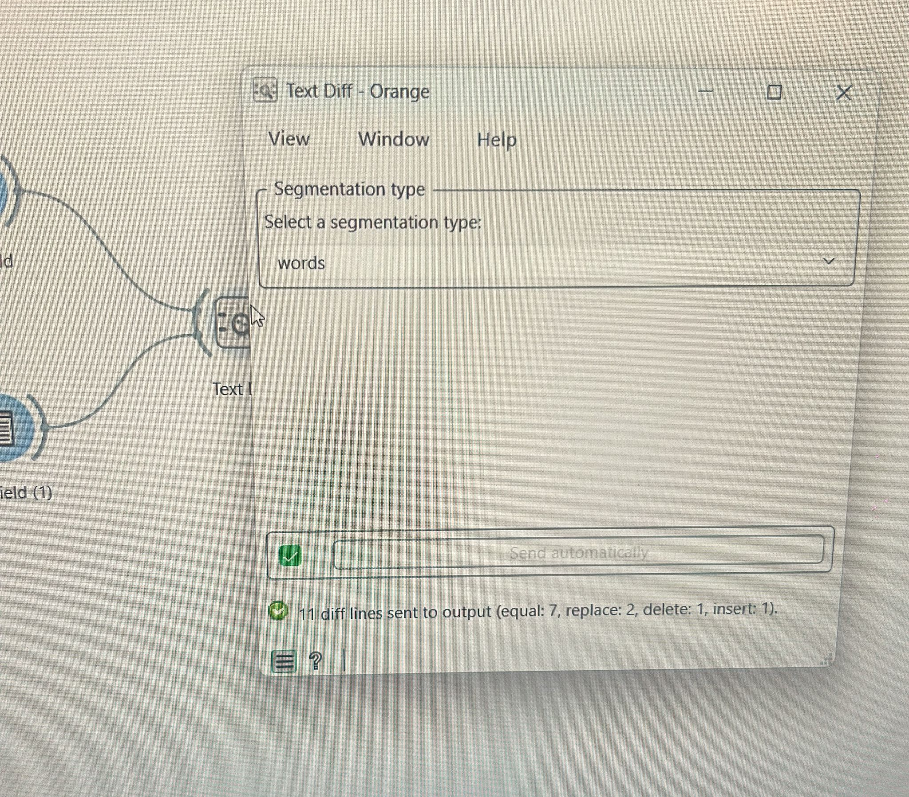

.. meta::
   :description: Orange3 Textable Prototypes documentation, TextDiff widget
   :keywords: Orange3, Textable, Prototypes, documentation, TextDiff, widget

.. _TextDiff:

TextDiff
=============

The TextDiff widget compares two version of the same text —such as different translations of a single work— and highlights the differences between them.

Authors
-------
Ilana Senape, Valentin Armbruster, Nada Waly, Théo Esseiva, Alyssa Gheza.

Signals
-------
Inputs:
- ``TextField``
  TextField is a text type of widget, that perrmit us to import text data from keyboard input.
  TextField provide to the widget TextDiff the text data that it has to compare.
  TextDiff will need two TextField input to do a comparison.
- ``TextFile``
  TextFile is a text type of widget, that permit us to import data from raw text files and to normalise them.
  TextFile provide to the widget TextDiff the text data that it has to compare.
  TextDiff will need one or two TextFile to do a comparison.

  TextDiff can also accept one input TextField and one input TextFile to do a comparison.

Outputs: 
- ``DataTable``
  The DataTable widget displays attribute-value data in a spreadsheet, what permit the user to 
  visualy read the comparison done by TextDiff in the shape of a data table.

Description
-----------
Explain what the widget does and describe the interface section by section.

This widget aims to compare two text inputs from the same source (e.g., two versions of a document) and visualize the differences between them in a data table. Text_Diff supports any language as long as the inputs are in the same language and can be used for any type of text forasmuch as they share the same type (e.g., news articles, scientific papers, etc.). It takes a text file or a text field as input and outputs a visualization of the differences. 

Basic Interface 
~~~~~~~~~~~~~~~~~~~~~~~~
in it's basic version (see :ref:`figure 1 <text_diff_fig1>`), the **Text Diff** widget allows the user to compare two text inputs and visualize the differences between them in a data table.

.. _text_diff_fig1: 

    Figure 1: **Text Diff** widget (basic interface).

The **inputs** section allows the user to connect two text sources (Text Files or Text Fields) to compare. The widget will only activate if both inputs are connected. 

The **segmentation** section allows the user to choose the level of segmentation for the comparison (e.g., word or sentence). The default segmentation is at the word level.

The **status bar** it dsplays a summary of the emitted output, showing the number of segments emitted and the number of differences identified between the two texts. It also indicates if the widget is ready to emit an output (e.g., if both inputs are connected and contain valid data).

 The **data table** displays the the differences between the two texts, with columns for the type of difference, the source segment, the target segment, and their respective locations in the text. The comparison is based on the difflib library, which segments the texts and identifies the differences. The possible types of differences are:

- Equal : the text segments are identical in both inputs.
- Replace: the text segments are different in both inputs (e.g., a word is replaced by another).The source segment is marked as "replace". 
- Insert: the text segment is present in the target input but not in the source input. The source segment is marked as "insert".
- Delete: the text segment is present in the source input but not in the target input. The source segment is marked as "delete".

The **Send** button triggers the emission of a segmentation to the output connection(s). When it is selected, the **Send automatically** checkbox disables the button and the widget attempts to automatically emit a segmentation at every modification of its interface.

Advanced Interface
~~~~~~~~~~~~~~~~~~~~~~~~

The **options** section allows the user to customize the comparison and visualization of differences. For example, the user can set a threshold for similarity between segments.

The **info** section indicates the reasons why no output is emitted (e.g., no inputs connected, empty file, etc.).

The  **Send** button and **Send automatically**, operate in the same way as in the basic interface.

Messages
--------
Information
~~~~~~~~~~~
* **<N> diff lines sent to output**
  Indicates that the text comparison was successful and the results have been successfully emitted to the next widget.

Warnings
~~~~~~~~
*<warning 1>*
**Texts are radically different**: Occurs when the two connected texts have little to no overlap (e.g., comparing two completely unrelated books). The widget will still process the data, but the output will mostly consist of large "delete" and "insert" blocks rather than nuanced "replace" or "equal" segments.
  *Fix:* Ensure that the texts you are comparing are indeed different versions of the same source (e.g., two translations of the same work, or two editions of a book). If you are trying to compare two completely different texts, consider using a different widget designed for that purpose.

Errors
~~~~~~

* **Not enough inputs**
  Occurs when less than the required number of text sources are connected. 
  *Fix:* Ensure you have connected valid text sources. The widget typically requires two text inputs (e.g., two Text Files, two Text Fields, or a combination of both) to perform a comparison.

* **Too many inputs**
  Occurs if more than two text sources are connected to the widget. 
  *Fix:* The Text Diff widget can only compare two texts side-by-side. Disconnect the extra inputs.

* **Invalid input type**
  Occurs when a connected widget sends data that is not recognized as text. 
  *Fix:* Ensure you are strictly connecting widgets that output valid text data (such as **Text File** or **Text Field**).
