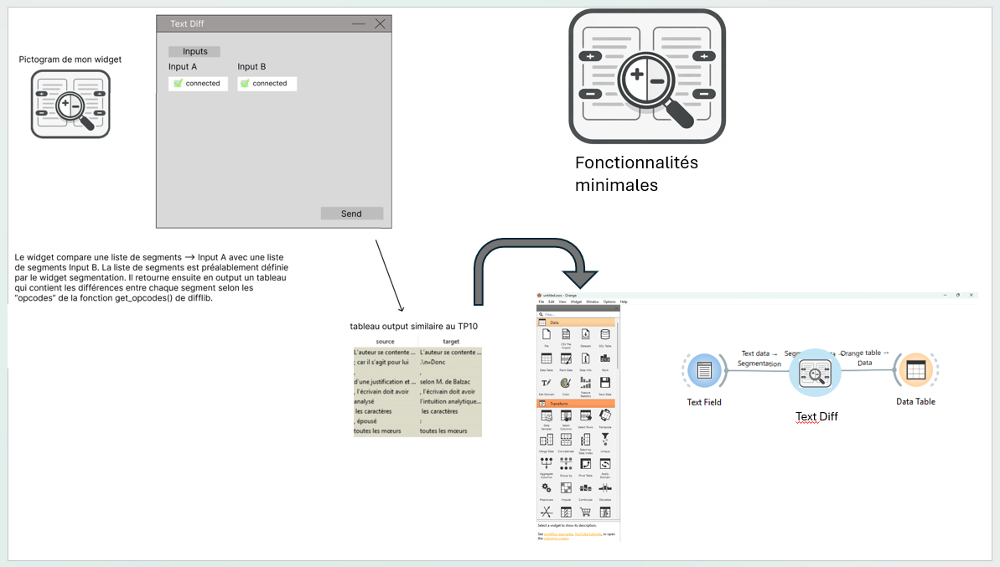
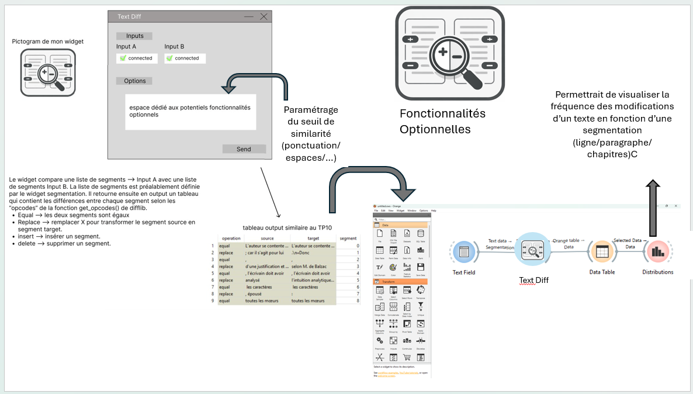

################################ Spécifications widget Text_Diff (comparaison de texte) ################################

1 Introduction
**************

1.1 But du projet
=================

Ce widget permet de comparer plusieures versions d'un même texte, dans une même langue, afin d'en extraire les différences. Il s'adresse aux chercheurs en littérature, aux traducteurs ou à tout utilisateur souhaitant identifier les variantes entre deux textes de même nature.

Entrées: Exactement deux widgets de type Text Field ou Text Files.
Sortie: Un tableau(Data Table) répertoriant les différences entre les deux textes, avec la possibilité de visualiser les modifications (Visualize Distribution) et leur emplacement dans le texte. 

La plus value du widget réside dans l'accessibilité de la comparaison de texte, qui peut être un processus complexe et fastidieux, surtout pour les textes longs. En automatisant ce processus, le widget permet aux utilisateurs de gagner du temps et d'obtenir des résultats plus précis et détaillés.  

1.2 Aperçu des étapes
=====================
* Première version des spécifications: 17.03.2025
* Remise des spécifications: 24.03.2025
* Version alpha du projet: 21.04.2025
* Version finale du projet: 26.05.2025

1.3 Équipe et responsabilités
=============================

* Ilana Senape (ilana.senape@unil.ch)
	- Documentation
	- Spécifications
    - Coordination du projet

* Valentin Armbruster (valentin.armbruster@unil.ch)
	- Code
	- Fonctionnalités principales
	- Gestion de la logique difflib

* Nada Waly (nada.waly@unl.ch)
	- Code
	- Interface graphique

* Théo Esseiva (théo.esseiva@unil.ch)
	- Gestion des entrées et sorties
	- Tests

* Alyssa Gheza (alyssa.gheza@unil.ch)
	- Documentation
	- Spécifications
	- Coordination de l'équipe

2. Technique
************

2.1 Dépendances
===============
* Orange 3 ( version 3.40+)
* Orange Textable 3.2.7
* Fork étudiant : `https://github.com/SIla25T/orange3-textable-prototypes.git`
* Diff lib (librairie standard Python) 

2.2 Fonctionnalités minimales
=============================

* FM1 — Filtrage strict des entrées. Le widget ne doit s'activer que si deux sources de texte sont connectées (Text Files ou Text Field). 
* FM2 —  Génération d'une liste/un tableau de comparaison des deux textes, indiquant les différences (ajout, suppression, modification) et leur emplacement dans le texte (gérer par difflib).
* FM3 - Le widget doit pouvoir segmenter efficacement les textes pour que la comparaison soit pertinente (gérer par difflib).  

2.3 Fonctionnalités principales
===============================
.. image:: images/TextDiff_principal.png

* FP1 — Identification sémantique des changements (ajout, suppression, modification)
* FP2 — Le widget indique l'index des caractères ou du numéro de ligne impacté. 

2.4 Fonctionnalités optionnelles
================================

	

* FO1 — Visualisation de la densité des changements via une fenêtre de recherche.
* FO2 — Paramétrage du seuil de similarité (ponctuation, espaces, etc.) 

2.5 Tests
=========
TODO 

Décrire une liste de scénarios (voir capsules “Specs 3”).

- scénarios OK
	1) Tester qu'il y a bien deux inputs connectés (Text Files ou Text Field). 
	2) Tester qu'il y ait au moins une similarité entre les textes. 

- scénarios None / entrée manquante
	1) Une seule entrée connectée: Le widget affiche un message d'avertissement ("Waiting for second input"). 
	2) Aucune entrée connectée: Le widget affiche un message d'avertissement ("Waiting for inputs").
	3) Fichier vide:  Notification à l'utilisateur ("Input file is empty".)  
	
- scénario paramètre invalide
	1) Tentative de connecter un type de donnée non textuel (ex: Image) - Rejet de la connexion et message d'erreur "Invalid input type. Please connect a Text File or Text Field."
	2) Tentative de connecter plus de deux sources de texte - Rejet de la connexion et message d'erreur "Too many inputs. Please connect exactly two Text Files or Text Fields."

3. Étapes
*********

3.1 Version alpha
=================
* L'interface graphique de base est construite (inputs, outputs, paramètres).
* Les fonctionnalités minimales sont implémentées et testables.
* Intégration réussie dans l'environnement Orange via pip install -e.

3.2 Version finale
==================
* Fonctionnalités principales complètes
* Robustesse (None, erreurs, outputs vidés correctement)
* Documentation (EN) cohérente
* Tests / scénarios de validation exécutés

4. Infrastructure
*****************

orange3-textable-prototypes/
├── specs/
│   └── TextDiff.rst          # Spécifications
├── doc/
│   └── widgets/
│       └── TextDiff.rst      # Documentation utilisateur
├── orangecontrib/
│   └── textable_prototypes/
│       └── widgets/
│           ├── TextDiff.py   # Code source principal
│           └── icons/
│               └── Text_Diff.png

Le projet est disponible sur GitHub :
`https://github.com/SIla25T/orange3-textable-prototypes.git`

